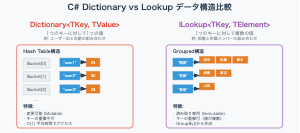

# DictionaryとLookUpの違い
主な違いはKeyに対する値が単一か（Dictionary）、複数か(LookUp)です。<br/>
イメージはこんな感じ。



# Dictionary

https://learn.microsoft.com/ja-jp/dotnet/api/system.collections.generic.dictionary-2?view=net-8.0

- 同じキーに紐づく値は基本的に一つ（Listなどコレクション型を値にすれば複数も可）
- 値の追加・削除・更新が自由
- CRUD（作成・読み込み・更新・削除）が中心となる管理や高速アクセスが必要な場面に適している

## 実装例
```c#
// Dictionaryを作成
// ユーザーIDと年齢の組み合わせ
var userAges = new Dictionary<string, int>
{
    ["user1"] = 25,
    ["user2"] = 30,
    ["user3"] = 28
};

// 基本的なアクセス方法
foreach (var kvp in userAges)
{
    Console.WriteLine($"  {kvp.Key} → {kvp.Value}歳");
}

// 出力結果
// user1 → 25歳
// user2 → 30歳
// user3 → 28歳 

// 指定のキーからアクセス
int user2Age = userAges["user2"];
Console.WriteLine($"user2の年齢: {user2Age}歳");

// 出力結果
// user2の年齢: 30歳

// 要素の追加・更新（変更可能）
userAges["user4"] = 35;  // 新しい要素を追加
userAges["user1"] = 26;  // 既存の要素を更新

foreach (var kvp in userAges)
{
    Console.WriteLine($"  {kvp.Key} → {kvp.Value}歳");
}

// 出力結果
// user1 → 26歳
// user2 → 30歳
// user3 → 28歳
// user4 → 35歳

// 安全な取得方法
// TryGetValueを使えば存在しないキーを指定しても例外が発生しない
if (userAges.TryGetValue("user5", out int age))
{
    Console.WriteLine($"user5の年齢: {age}歳");
}
else
{
    Console.WriteLine("user5は存在しません");
}

// 出力結果
// user5は存在しません
```

# LookUp

https://learn.microsoft.com/ja-jp/dotnet/api/system.linq.lookup-2?view=net-8.0

- キーごとに「複数の値（IEnumerable）」を持つ（1対多のマッピング）
- 生成後は要素の追加・削除・更新が不可
- LINQのToLookupメソッドで作成されることが多く、即時実行されるのが特徴
- GroupByに似ていますが、lookup[key]のようにインデクサでアクセス可能
- 「グループごとに値をまとめて管理・参照したい」ときに適している

## 実装例
```c#
// 従業員データの準備
var employees = new[]
{
    new { Name = "田中", Department = "開発" },
    new { Name = "佐藤", Department = "開発" },
    new { Name = "鈴木", Department = "開発" },
    new { Name = "高橋", Department = "営業" },
    new { Name = "渡辺", Department = "営業" },
    new { Name = "山田", Department = "管理" }
};

// LINQで部署別にグループ化してLookupを作成
var departmentLookup = employees.ToLookup(emp => emp.Department, emp => emp.Name);

// 基本的なアクセス方法
foreach (var group in departmentLookup)
{
    Console.WriteLine($"{group.Key} → [{string.Join(", ", group)}]");
}

// 出力内容
// 開発 → [田中, 佐藤, 鈴木]
// 営業 → [高橋, 渡辺]
// 管理 → [山田]

// 指定のキーからアクセス
foreach (var member in departmentLookup["開発"])
{
    Console.WriteLine($"- {member}");
}

// 出力内容
// - 田中
// - 佐藤
// - 鈴木

// 存在しない部署を指定した場合は空のシーケンスが返される
var hrDepartment = departmentLookup["人事部"];
Console.WriteLine($"人事部のメンバー数: {hrDepartment.Count()}");

// 出力内容
// 人事部のメンバー数: 0
```

# まとめ
<table border="1">
  <tr>
    <th>項目</th>
    <th>Dictionary</th>
    <th>Lookup（ILookup）</th>
  </tr>
  <tr>
    <td>構造</td>
    <td>キーごとに値を1つ保存（ハッシュテーブル）</td>
    <td>キーごとに値のグループ（IEnumerable）を保存（内部的にハッシュテーブル管理）</td>
  </tr>
  <tr>
    <td>値の個数</td>
    <td>各キーに対して単一値</td>
    <td>各キーに対して複数値（0個～）</td>
  </tr>
  <tr>
    <td>可変性</td>
    <td>追加・削除・更新可能（ミュータブル）</td>
    <td>生成後は変更不可（イミュータブル）</td>
  </tr>
  <tr>
    <td>用途</td>
    <td>1対1管理、CRUD、状態管理用途</td>
    <td>1対多のグループ化、主にLINQによる集約結果の利用</td>
  </tr>
  <tr>
    <td>代表的な生成方法</td>
    <td>new Dictionary&lt;TKey, TValue&gt;()</td>
    <td>IEnumerable.ToLookup()</td>
  </tr>
  <tr>
    <td>主なアクセス方法</td>
    <td>dict[key]</td>
    <td>lookup[key] ※戻り値はIEnumerable</td>
  </tr>
</table>

# 参考記事
https://qiita.com/Nossa/items/434ce8471509f0e563e8

