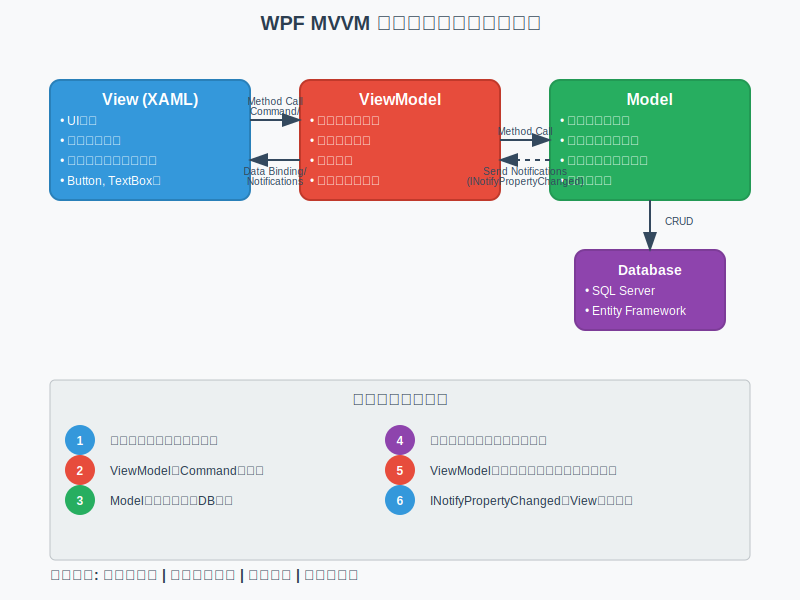

# イメージ図
MVVM とは何かということは既に調査済みとのことなのでそこの説明は省略しますね。<br/>
とりあえず、各レイヤーの役割分担はこんな感じです。AIに頼んだらサクッと作ってくれました。



※　DB がSQL ServerとEntity Frameworkになってますが、そこは気にしないで自分が使うものに置き換えて考えてください。

# MVVM で設計すると嬉しいこと
まず理解して欲しいのが MVVM で設計することでどのようなメリットがあるかです。<br/>
ViewModel - Model の棲み分けからは若干話が逸れますが、大切なことなので先に説明しておきます。

## 1. UI(画面側の部品) と内部処理を分離できる
UI 側の処理とそこで扱うデータの管理を同じところで実装していると、保守性があまり良くありません。

単純にどこで何をやっているかがわかりにくいからですね。<br/>
画面の描画用処理と内部処理を分けておくことで各々の役割が明確になります。

これはクラス設計の話にも繋がりますが、1クラスの役割は単一しておくのがセオリーです。

ファイルやクラスごとに明確に役割を分けておくことで、バグ解析が楽になります。<br/>
画面が期待通りに表示されないとき、View 側の実装が問題なのか、それ以外のロジックが問題なのかといった感じに問題の切り分けがしやすくなります。

また、ViewModel の設計が上手いことできていると、UI を変更するときにビジネスロジックをいじらなくても良いという利点もあります。

ここでは View - ViewModel 間に寄せた説明をしましたが、ViewModel - Model 間でも同じことが言えます。

まず、M - VM - M それぞれで役割をしっかり分けることの大切さを理解して欲しいです。

## 2. 再利用性の向上
DB を利用するアプリケーションの場合、いろんな View や ViewModel から同じ DB アクセス処理を利用したいはずですよね？

それなのに、各 ViewModel クラスでそれぞれDBアクセス処理を実装しているとメンテナンスがかなり大変になります。

新しい View を作りたいときにまた独自で実装しなければならないですし、そこで実装ミスが起きるとバグを埋め込むことになります。

再利用が可能なクラスとして定義しておくことでアプリケーション全体の堅牢性を高めることができます。一箇所にまとめておけば、使用する DB を変えたいときやテーブルの定義が変わったときも簡単に対応できますね。

# 実際にどう分けるか？
遠回りしましたが、本題に入ります。

## View
View に関してはなんとなくイメージできていると思います。
WPF でいえば xaml と xaml.cs(コードビハインドと呼ぶ)が View に該当します。

コードビハインドは xaml の部品と依存関係が強く、画面描画に対して色々なことができてしまうので一般的にはここに処理をたくさん書くのは推奨されません。

xaml に UI 部品を実装して、そこに反映させるデータの細かい処理は ViewModel に任せるべき。

コードビハインドで`DataContext`に任意のクラスを指定すれば View と ViewModel を紐づけることができます。

例）MainWindowとMainWindowViewModelを紐づけたいとき
```c#
public partial class MainWindow : Window
{
    public MainWindow()
    {
        InitializeComponent();
        DataContext = new MainViewModel(); // ViewModelを関連付け
    }
}
```

画面に描画する部品だけの実装と考えておけば良いでしょう。
（もちろん複雑な View の場合は例外もありますが...）

## ViewModel / Model
ひとことでいうなら、<br/>
**その画面(部品)だけに必要な処理** →　ViewModel <br/>
**アプリケーション全体(もしくは複数の画面)に必要な処理** →　Model<br/>
です

例えば、TODO管理アプリのTODO一覧を表示する画面で完了済みのタスクを分けて表示したいとします。

DB に登録されているTODOリストを一覧で取得する処理はアプリ全体で必要ですが、そこからデータを仕分けする作業はこの画面だけで必要になると思います。

👇 実装するとしたらこんな感じ
```c#
public class TodoListViewModel
{
    // TODOをDBから取得するためのサービスクラス
    // 中でDBアクセス処理等が実装されているものと考えてください
    private TodoService _todoService;

    // 未完了のタスクリスト
    public ObservableCollection<TodoItem> IncompleteTodos { get; set; }
    // 完了済みのタスクリスト
    public ObservableCollection<TodoItem> CompletedTodos { get; set; }

    public TodoListViewModel()
    {
        // DBから一覧取得
        // 例外発生の可能性があるので、本当はコンストラクタでDBアクセスしにいくのは×
        this._todoService = new TodoService();
        var allTodos = this._todoService.GetAllTodo();

        // 未完了
        this.IncompleteTodos = new ObservableCollection<TodoItem>(
            allTodos.Where(item => !(item.IsCompleted)));

        // 完了済み
        this.CompletedTodos = new ObservableCollection<TodoItem>(
            allTodos.Where(item => item.IsCompleted));
    }
}

// TODO一個の情報を格納するクラス(Modelに分類したい)
public class TodoItem
{
    // 他のプロパティは省略

    // 完了済みのタスクか
    public bool IsCompleted { get; set; }
}
```

TODOリストの取得をサポートする`TodoService`とその先の DB アクセス処理、TODOの情報を保持しておく`TodoItem`はアプリケーションのいろんなところから触りたいはずなので Model として分けておくと良いでしょう。

ただ、そこから画面表示したい内容によってデータを加工するのは ViewModel の役割です。<br/>
未完了のタスクを仕分けするのがこの画面だけであることを前提にしてますが、もし他の画面からも必要な処理ならば Model に存在する`TodoService`に未完了か完了済みかで分けてタスクを取得する処理を移動することを検討してもいいかもしれません。（ここが難しいところですね）

ちなみに、データ取得だけでなくデータの追加等の処理も同じ考えで大丈夫です。
画面で入力した値を受け取って追加したい旨をリクエストするところまでが ViewModel 、その先の処理が Model に分類するで良いかと。

### もし迷ったときは
**「もしこの画面を削除したら、このコードは他で使われるか？」**<br/>
**YES** → Model に書く<br/>
**NO** → ViewModel に書く

**「もし画面デザインが大幅に変わったら、このコードは変更されるか？」**<br/>
**YES** → ViewModel に書く<br/>
**NO** → Model に書く

画面への依存度で分けてみてください。

# 実装時の注意点
各レイヤーの参照方向に注意してください。<br/>
基本的な参照方向の原則は View → ViewModel → Model です。

参照というのは、単純にそのクラスの処理を使っているかどうかです。

## NG例1: Model から ViewModel の参照
```c#
// Model に存在するサービスクラス
public class TodoService
{
    // DBアクセス処理を担うアクセサー
    // 中身は実装されているものと考えてください
    private DbAccessor _accessor

    // ❌ ModelがViewModelを参照
    private TodoListViewModel _viewModel; 
    
    // DBからTODO全リストを取得するメソッド
    public void GetAllTodo()
    {
        // クエリ実行
        string query = "SELECT * FROM TODO";
        var todos = this._dbAccessor.ExecuteQuery(query);

        // ❌ ModelからViewModelを直接操作
        _viewModel.RefreshList(todos); 
    }
}
```

### 問題点
- `TodoService`が他の ViewModel から利用できなくなる

Model はアプリケーション全体で利用する処理なので、他のレイヤの影響を受けたくないです。<br/>
Model からは ViewModel も View も参照しないように注意です。<br/>

## NG例2: ViewModel から View の参照
```c#
// ViewModel
public class TodoListViewModel
{
    // ❌ ViewModelがViewを直接参照
    private TodoListView _view;

    // エラーメッセージを表示するメソッド
    public void ShowError(string message)
    {
        // ❌ ViewModelからViewを直接操作
        _view.ShowMessageBox(message);
    }
}
```

### 問題点
- `TodoListViewModel` が他の View から使えなくなる（他の View から ViewModelを紐づけたいケースはあまりないけど）
- View 変更時に ViewModel の修正が必要になる可能性大

ViewModel から View 側の処理を呼び出さないように注意です。<br/>
この参照方向を守っておけば、各々のレイヤが他の保守性がUPします。

# 最後に
まずやるべきこととしては、役割ごとにしっかりクラスを分割することですかね。<br/>
そのあとはレイヤごとにフォルダを分けて格納しておくと見やすくなります。

👇先ほどの実装例で見せたクラス群を分けるとしたら..<br/>
(デフォルトで作成されるファイルは書いていないです)
```
TodoApp/(プロジェクトのルートディレクトリ)
├── Views/
│    ├── TodoList.xaml
│    └── TodoList.xaml.cs
├── Models/
│    ├── TodoService.cs
│    ├── TodoItem.cs
│    └── DbAccessor.cs
├── ViewModels/
    └── TodoListViewModel.cs
```

ここまで理想論を述べてきましたが、実際はそこまで上手くいかないことも多いです。<br/>
UI の変更に伴って ViewModel の変更をすることもありますし、 ViewModel が巨大になりすぎてたくさんの役割を持ってしまっていることも多々あります。

なので最初はそこまで難しく考えずに、DB を触りそうな処理は Model、そのリクエストを投げるまでが ViewModel ぐらいの感覚でいいかもしれません。

