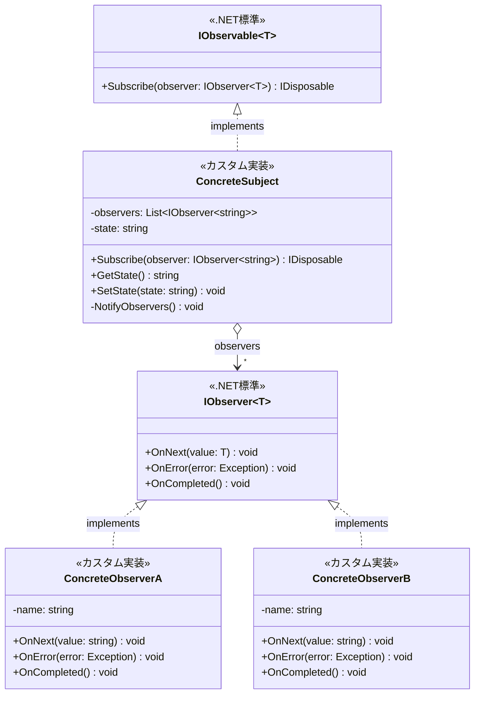

# Observerパターンとは？
あるオブジェクトの状態変化を登録されている複数のオブジェクトに自動的に通知するためのデザインパターンです。

通知を発行する発行元(Observable, Subject)とそれを受け取る受信者(Observer)を実装することで成立します。

簡単にクラス図に起こすと以下のイメージです。



.NET標準でIObservable<T>(発行元)とIObserver<T>(受信者)といったObserverパターンを簡単に実現できるインターフェースが用意されているのでそれを実装するだけですね。

# どんな時に使う？
Observerパターンが向いているケース
- 状態変化を他のオブジェクトへ自動通知したいケース
- ボタンのクリックイベントやメニュー選択イベントを複数の箇所で受け取りたいケース
- データバインディングやモデル-ビュー感の同期
- 通知システムの実装
- ソフトウェアのモジュール間の結合度を下げたいケース

# メリット
- SubjectとObserverが直接依存しないため、保守性や拡張性UP
- 複数のObserverが独立したモジュールとして切り出せるため、システムの各機能の再利用性UP

# いざ実践！
とりあえず.NETの標準機能を使って簡単なObserverパターンをただただ実装してみます。

## 要件
- コンソールアプリケーション
- たかしくんとはなこさんがいて、ラーメン、カレーの順に二人に渡す
- たかしくんはラーメンが好き、はなこさんはカレーが好き
- 好物が出されたときは、「大好物です！いただきます」と出力
- 好物でないときは、「あまり好きじゃないけど…。いただきます…。」と出力

## コード
```MenuSubject.cs
/// <summary> 献立の変化を管理する被監視者クラス: ConcreteSubject </summary>
public class MenuSubject : IObservable<string>
{
    /// <summary> 変更通知を受け取るObserver </summary>
    private List<IObserver<string>> observers = new List<IObserver<string>>();

    /// <summary> 設定されている献立 </summary>
    private string menu = string.Empty;

    /// <inheritdoc/>
    public IDisposable Subscribe(IObserver<string> observer)
    {
        if (!this.observers.Contains(observer))
        {
            this.observers.Add(observer);
        }
        // 呼び出し側で購読解除ができるようにIDisposableを返す
        return new Unsubscriber(observers, observer);
    }

    /// <summary> 設定されている値を取得 </summary>
    public string GetMenu() => this.menu;

    /// <summary> 値を設定して変更を通知 </summary>
    public void SetMenu(string state)
    {
        this.menu = state;
        this.NotifyObservers();
    }

    /// <summary> Observerたちに変更を通知 </summary>
    private void NotifyObservers()
    {
        foreach (var observer in this.observers)
        {
            try
            {
                observer.OnNext(this.menu);
                observer.OnCompleted();
            }
            catch (Exception e)
            {
                observer.OnError(e);
            }
        }
    }
}
```

```Unsubscriber.cs
/// <summary> 購読解除用のヘルパークラス </summary>
public class Unsubscriber : IDisposable
{
    private List<IObserver<string>> observers;
    private IObserver<string> observer;

    public Unsubscriber(List<IObserver<string>> observers, IObserver<string> observer)
    {
        this.observers = observers;
        this.observer = observer;
    }

    public void Dispose()
    {
        if (observers.Contains(observer))
        {
            observers.Remove(observer);
        }
    }
}
```

```Eater.cs
/// <summary> メニューを食べる人: ConcreteObserver </summary>
public class Eater : IObserver<string>
{
    private readonly string name;
    private readonly string favorite;

    public Eater(string name, string favoriteFood)
    {
        this.name = name;
        this.favorite = favoriteFood;
    }

    // OnNextが正常に完了した後の処理
    public void OnCompleted()
    {
        Console.WriteLine("ごちそうさまでした！");
    }

    // エラー発生時の処理
    public void OnError(Exception error)
    {
        Console.WriteLine($"エラー発生: {error.Message}");
    }

    // 変更通知を受け取った後に実行される処理
    public void OnNext(string value)
    {
        Console.Write($"{this.name}: ");
        Console.WriteLine(value == favorite
            ? "大好物です！いただきます！"
            : "あまり好きじゃないけど…。いただきます…。"
        );
    }
}
```

```Program.cs
public class Program
{
    // メイン処理
    public static void Main(string[] args)
    {
        // ConcreteSubject(被監視者)の作成
        var menuSubject = new MenuSubject();

        // ConcreteObserver(監視者)の作成
        var takashi = new Eater("たかし", "ラーメン");
        var hanako = new Eater("はなこ", "カレー");

        // 購読開始
        var takashiSubscription = menuSubject.Subscribe(takashi);
        var hanakoSubscription = menuSubject.Subscribe(hanako);

        // ラーメン
        Console.WriteLine("ラーメンをどうぞ！");
        menuSubject.SetMenu("ラーメン");
        // 改行用
        Console.WriteLine();
        // カレー
        Console.WriteLine("カレーをどうぞ！");
        menuSubject.SetMenu("カレー");

        // 購読を解除
        takashiSubscription.Dispose();
        hanakoSubscription.Dispose();

        // 購読解除後は値を変更しても変更通知されない
        menuSubject.SetMenu("ハンバーグ");
    }
}
```

```出力結果
ラーメンをどうぞ！
たかし: 大好物です！いただきます！
たかし: ごちそうさまでした！
はなこ: あまり好きじゃないけど…。いただきます…。
はなこ: ごちそうさまでした！

カレーをどうぞ！
たかし: あまり好きじゃないけど…。いただきます…。
たかし: ごちそうさまでした！
はなこ: 大好物です！いただきます！
はなこ: ごちそうさまでした！
```

購読を解除した後のハンバーグは誰にも通知が伝わっていないため出力されません。


