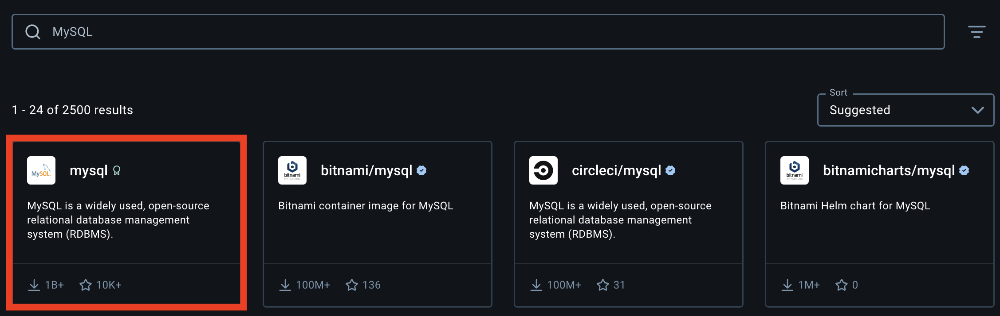
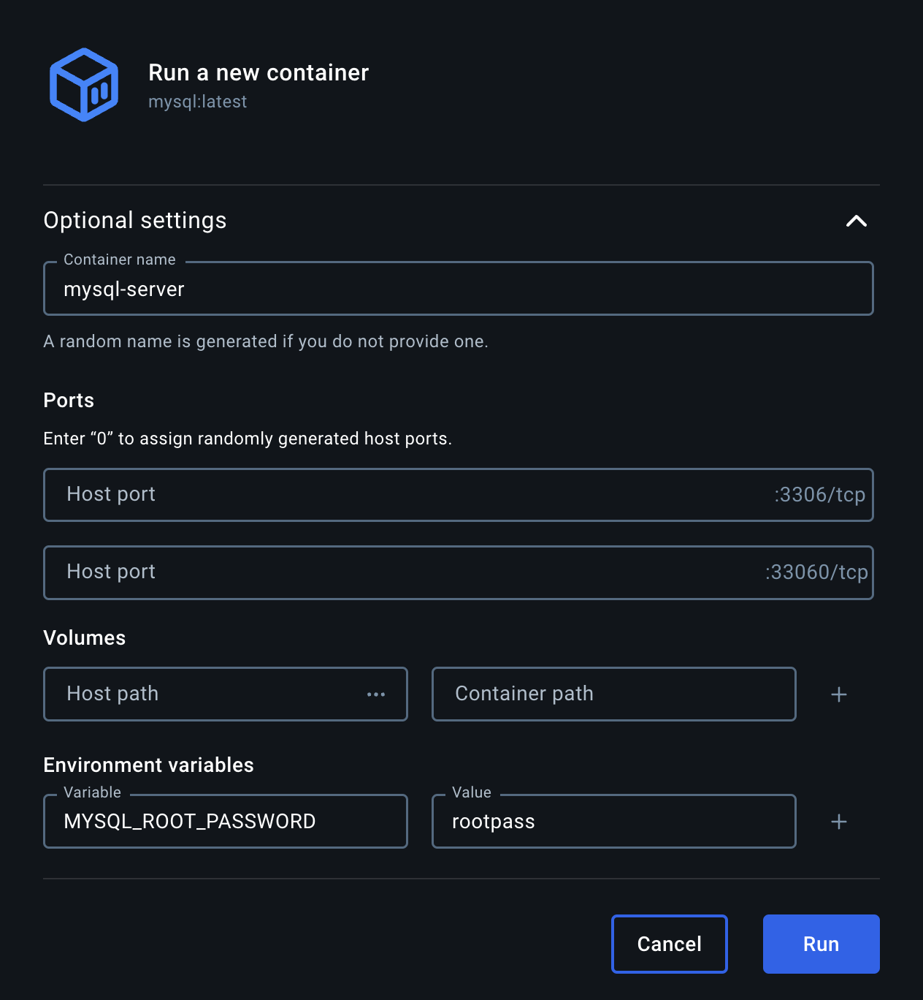
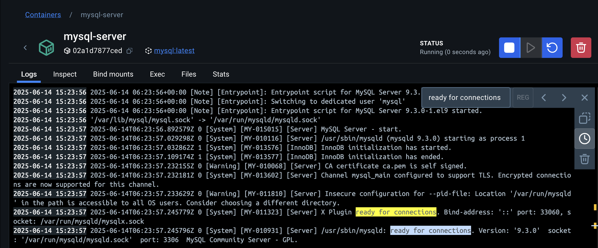
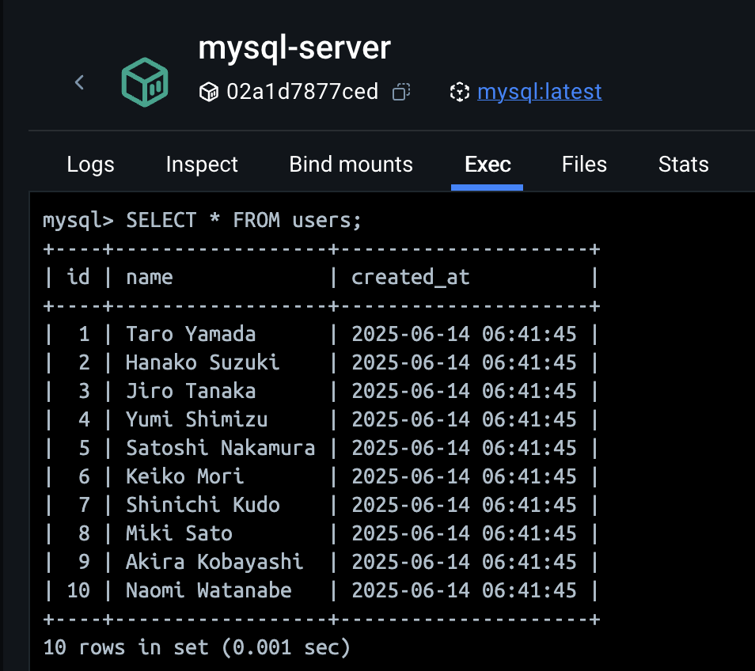

概念の理解が難しくて今まで触れてこなかった Docker

いや、細かいことは考えずとりあえず使ってみよう！
ということで今回は Docker を使って MySQL の環境構築をしてみたいと思います

# そもそも Docker とは

以下の記事が非常に参考になりました

https://qiita.com/Sicut_study/items/4f301d000ecee98e78c9

初心者なりの理解で説明すると、
「実行環境の整った状態のものを"コンテナ"として管理することで異なるシステム間でも動作可能にするためのプラットフォーム」
という感じですかね

# いざ実践

**完成イメージ図**
svg

**注意点**

- Docker が使用可能であることが前提(Docker のインストール等は省きます)
- Docker の基本概念(Image、Container etc...)の説明も省きます
- 今回はコマンド実行ではなく Docker Desktop を使用します
- macOS で実行しています（macOS Sequoia 15.5）

## STEP1: MySQL のイメージを取得

まずはイメージを取得するところから
MySQL に関しては公式のイメージがあるのでそれを使います

Docker Desktop の Docker Hub のタブから、mysql のイメージを検索して pull します


## STEP2: コンテナの作成

次は pull したイメージからコンテナを作成します

pull が完了すると Images タブに MySQL のイメージが追加されているので、Run ボタンをクリックします


すると、コンテナの設定画面が開くので必要事項を入力します

設定項目

<table>
    <tr>
        <th>設定項目</th>
        <th>内容</th>
        <th>備考</th>
    </tr>
    <tr>
        <th>Container name</th>
        <th>コンテナにつける名前</th>
        <th>好きな名前でOK</th>
    </tr>
    <tr>
        <th>Ports</th>
        <th>ポート番号</th>
        <th>ホスト(PC)とコンテナの番号を合わせる必要がある</th>
    </tr>
    <tr>
        <th>Volumes</th>
        <th>データ保存</th>
        <th>設定しておくとデータの永続化（保存）が可能になる</th>
    </tr>
    <tr>
        <th>Environment variables</th>
        <th>環境変数</th>
        <th>MySQL_ROOT_PASSWORD(管理者のパスワード)は設定必須</th>
    </tr>
</table>

今回はこんな感じで設定してみました


ポート番号はデフォルトのままにしてます。

また、動作確認が目的で永続化は必要ないため未設定にしてますが、コンテナを停止してもデータを残しておきたい場合には設定が必要となります

Container path には`/var/lib/mysql`を、HostPath には PC 上に MySQL のデータを保存する場所を指定します

# STEP3: コンテナの起動確認

設定が完了したら、Run ボタンをクリックします

Container タブでログが確認できますが、`ready for connections`と表示されていれば起動は問題ありません！



# STEP4: クエリ実行

接続が確認できたら、あとは通常の MySQL と同様の操作が実行できます 😌

まずは、コンテナの Exec タブから以下のコマンドを実行して MySQL にログインします
パスワードを求められるので STEP2 で設定した管理者のパスワードを入力すれば OK

```
mysql -u root -p
```

以下のクエリを実行してテーブルにデータを入れます

```sql
-- データベース作成
CREATE DATABASE testdb;

-- データベースに接続
USE testdb;

-- テーブル作成
CREATE TABLE users (
    id INT AUTO_INCREMENT PRIMARY KEY,
    name VARCHAR(100) NOT NULL,
    created_at TIMESTAMP DEFAULT CURRENT_TIMESTAMP
);

-- データ挿入
INSERT INTO users (name) VALUES
('Taro Yamada'),
('Hanako Suzuki'),
('Jiro Tanaka'),
('Yumi Shimizu'),
('Satoshi Nakamura'),
('Keiko Mori'),
('Shinichi Kudo'),
('Miki Sato'),
('Akira Kobayashi'),
('Naomi Watanabe');
```

最後はデータが入っているか確認します
緊張の瞬間...



しっかりデータが入ってました 🎉

#　まとめ
データベースは環境構築につまずきがちですが、ここまで簡単に構築できたのは感動です
これで Docker とも少し仲良くなれた気がします

まだまだできることはたくさんあると思うので、色々な使い方を学んでいきたいですね

この記事が同じく Docker を敬遠している世の中の誰かに響いてくれると嬉しいです
