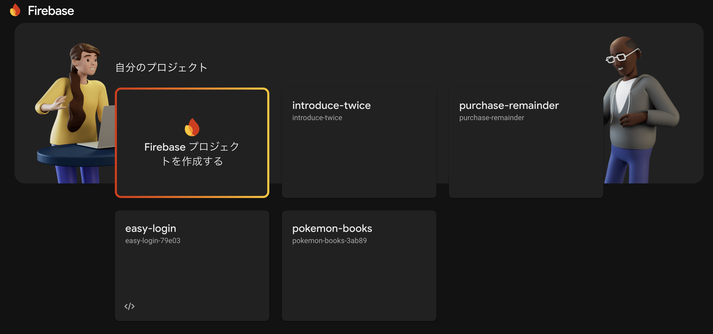
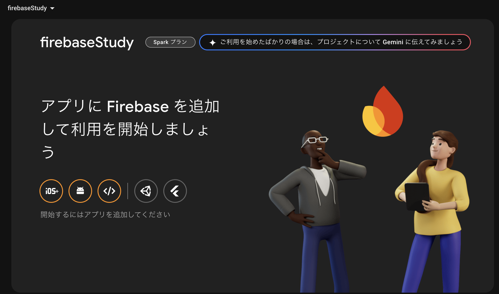
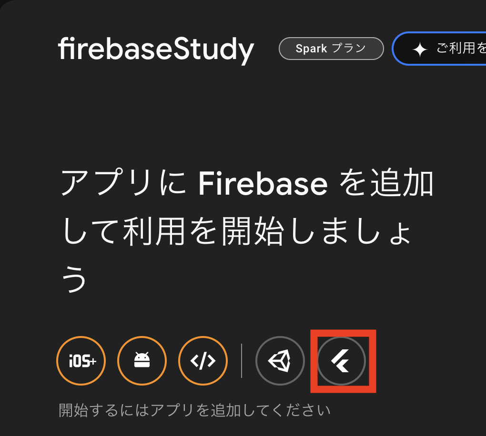
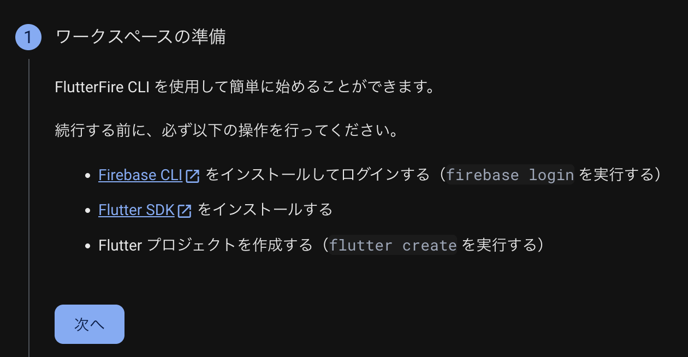
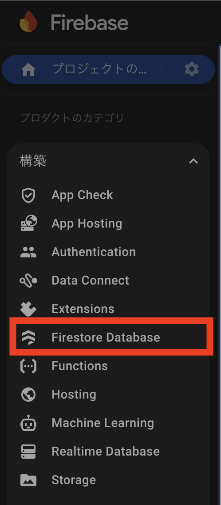
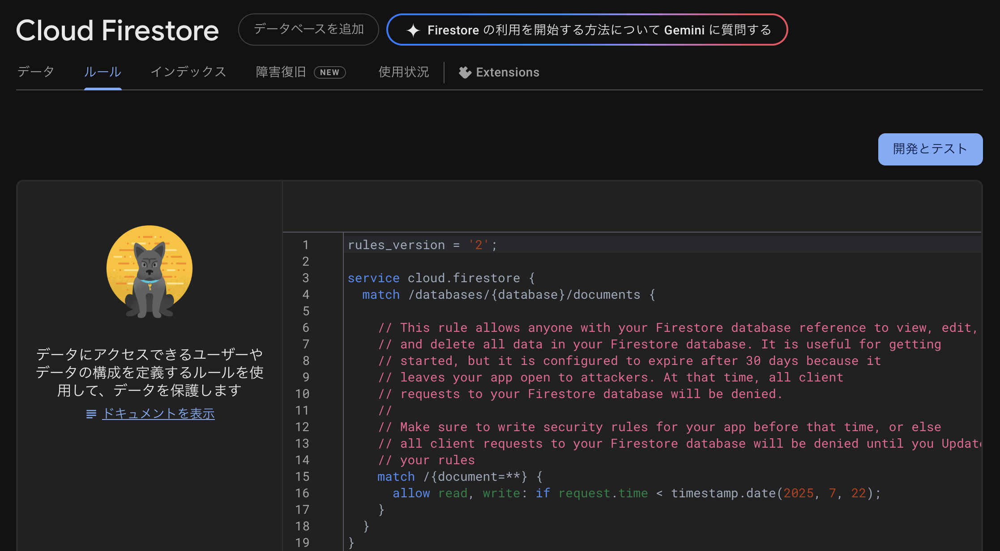
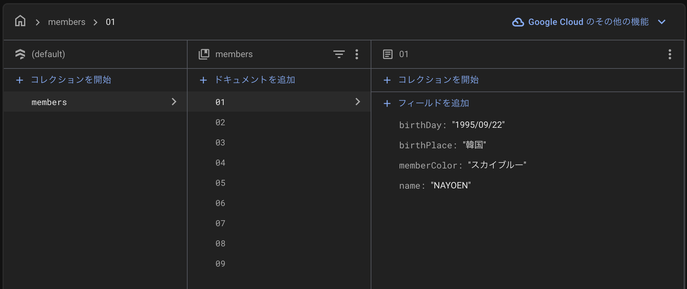
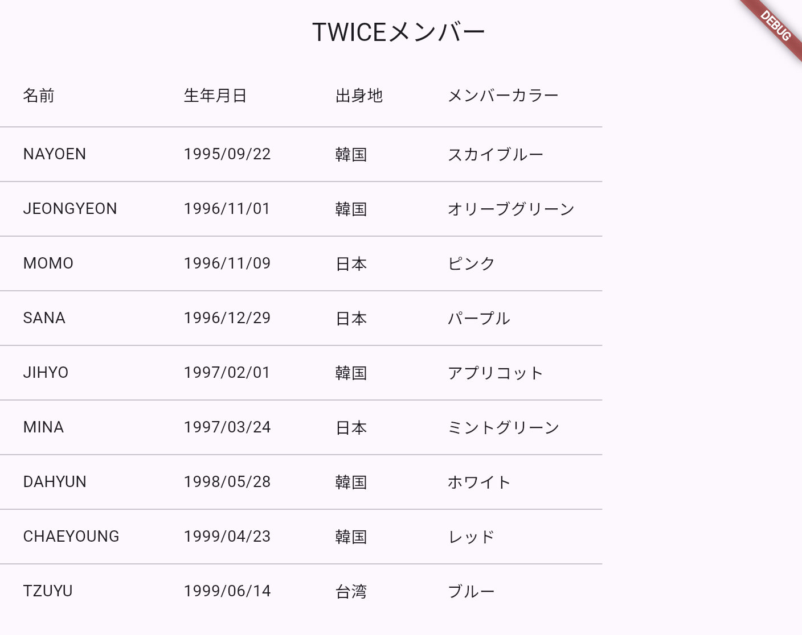

**「FlutterでFirebaseのデータベースと繋いでみたい！」**
と考えていたらちょうどキャンペーンをやっていたので手順をここにまとめておこうと思います

# 参考資料
https://firebase.google.com/docs/flutter/setup?hl=ja&platform=ios

https://youtu.be/BWTQkkLC-Mo?si=OGuFX0BctDej8kJQ

https://youtu.be/ZKww9U0jvAM?si=uz5BX_sUb58w8mVS

# 手順
1. Flutterアプリを作成（今回この手順は省略します）
2. Firebaseでプロジェクトを作成する
3. FlutterアプリとFirebaseを接続する
4. Firebaseにデータベースを作成する
5. アプリからデータベースを操作する

# 2.FireBaseでプロジェクトを作成する
Flutterの環境構築はすでに済んでいるものとして2から始めます

まず、Firebaseのにアクセスしてコンソール画面を開きます
そうすると、"Firebaseプロジェクトを作成する"という項目があるのでそこをクリックします


その後、プロジェクト名やアナリティクスを有効にするかどうかなど設定する画面が表示されるので好きな設定します

今回は"firebaseStudy"というプロジェクトを作ってみました
これでプロジェクトの作成は完了です！簡単ですね👍


# 3.FirebaseプロジェクトにFlutterアプリを追加する
FirebaseとFlutterはどちらもGoogleが開発しているものなので、連携は比較的簡単です
先ほどの画面でよく見るとFlutterアプリ追加用のボタンがありますね


これを押してみるとアプリ追加の手順を教えてくれます
この手順に従って進めるだけです

:::note info
投稿主はMacなのでMac用の手順となります
:::

## 3-1 ワークスペースの準備


まずはFirebase CLIをインストール
以下のコマンドを実行します
```
curl -sL https://firebase.tools | bash
```
これでFirebaseサービスの管理・設定をコマンドラインから実行できるようになります

Flutterアプリの環境構築ができていればFlutter SDKのインストールとFlutterプロジェクトの作成は完了しているため、下の二つは説明を省略します

## 3-2 FlutterFire CLIのインストールと実行


FlutterFire CLIとは、FlutterアプリでFirebaseを利用するためのコマンドラインツールです
このCLIをどのディレクトリからも利用可能にするためグローバルでインストールします
```
dart pub global activate flutterfire_cli
```

この後、環境変数にパスを通してくださいと警告が出ることがあります
```
Warning: Pub installs executables into $HOME/.pub-cache/bin, which is not on your path.
You can fix that by adding this to your shell's config file (.zshrc, .bashrc, .bash_profile, etc.):

  export PATH="$PATH":"$HOME/.pub-cache/bin"

```
その場合は以下のコマンドを実行してFlutterFireコマンドが使えるようにパスを通してあげましょう
```
echo 'export PATH="$PATH:$HOME/.pub-cache/bin"' >> ~/.zshrc
```

次は、FlutterFireコマンドで作成しておいたFlutterアプリをFirebaseに追加します
```
flutterfire configure --project=[プロジェクトID]
```
プロジェクトの配下にfirebase.options.dartというファイルが作成されていれば成功です

## 3-3 Firebaseの初期化とプラグインの追加
あとはアプリ側のコードでFirebaseの初期化をするだけです

`main`メソッドの中身を書き換えます
- asyncに変更
- `initializeApp`メソッドの追加

```dart
import 'package:firebase_core/firebase_core.dart';
import 'package:firebase_study/firebase_options.dart';

void main() async {
  await Firebase.initializeApp(
    options: DefaultFirebaseOptions.currentPlatform,
  );
  runApp(const MyApp());
}
```

ここまでくればアプリ内でFirebaseの各機能が使用可能になります
プラグインは使用したいFirebaseの機能に合わせて追加します

プラグイン一覧

https://firebase.google.com/docs/flutter/setup?hl=ja&authuser=0&_gl=1*6g80d4*_ga*MTg0NzkwNDY4LjE3NTA1NjE1MzY.*_ga_CW55HF8NVT*czE3NTA1NjQzOTAkbzIkZzEkdDE3NTA1NjU1OTQkajYwJGwwJGgw&platform=ios#available-plugins

# 4.Firebaseにデータベースを作成する
Firebaseのデータベースは"Firestore Database"という名前です
プロジェクトのホーム画面の左タブから構築 > Firestore Databaseを選択します


初回は以下のような画面になっているので、"データベースの作成"をクリックします


ロケーション、セキュリティルールを設定してデータベースを作成します
今回はロケーションを"asia-northeast(Tokyo)"、セキュリティルールをテストモードに設定します

これでデータベースが作成できましたが、このままではデータの書き込みや読み込みが制限されている状態になっています

Firestore Database のホームから、ルールタブをクリックします


現状だと、2025/7/22(作成日の1ヶ月後)を超えると操作が不可になる設定になっています
以下に書きえて一旦すべての権限を解放しておきます
```
rules_version = '2';

service cloud.firestore {
  match /databases/{database}/documents {

    match /{document=**} {
      allow read, write: if true;
    }
  }
}
```
"公開"ボタンを押して設定を適用します

:::note warn
今回は個人開発かつリリースしないアプリなので、制限を設けない設定にしています。上記の設定だと誰でもデータベース内のデータを操作することができてしまいます。必要に応じて適切な設定を行いましょう。
:::

## データ構造について
実際にデータを操作する前に、Firesore Databaseのデータ構造について説明しておきます
一般的なデータベースのようにテーブルという概念は存在しません

コレクション > ドキュメント > サブコレクション > ドキュメント の階層で格納されています
(サブコレクションがないパターンもあります)

例えば、Xのユーザーごとのデータを簡単に再現すると以下のようになります
```
/ (ルート)
└── users (コレクション)
    ├── user001 (ドキュメント)
    │   ├── name: "Suzuki Hanako"
    │   ├── age: 21
    │   ├── gender: "female"
    │   └── posts (サブコレクション)
    │       ├── post001 (ドキュメント)
    │       │   ├── text: "Hello World"
    │       │   └── timestamp: ...
    │       └── post002 (ドキュメント)
    └── user002 (ドキュメント)
        └── ...
```

# 5.アプリからデータベースを操作する
Firebase側の準備はできたので、いよいよアプリ側からデータベースを操作するコードを実装します

## 5-1 Firestoreプラグインの追加
コマンドラインでプラグイン追加コマンドを実行します
```
flutter pub add cloud_firestore
```

※ pubspec.yamlのdependenciesに`firebase_cloud_firestore:`を追加するでもOK

追加したプラグイン設定からパッケージを取得します
```
flutter pub get
```

## 5-2 データの挿入
新しいコレクションにデータを入れるための構文は以下
```dart
final db = FirebaseFirestore.instance;

await db
    .collection(/*コレクション名*/)
    .doc(/*ドキュメント名*/)
    .set(/*挿入したいデータ*/);
```

今回は筆者が愛してやまないTWICEメンバーのデータを入れてみます
```dart
import 'package:firebase_cloud_firestore/firebase_cloud_firestore.dart';

/// Firebaseと通信を行うためのサービスクラス
class FirebaseService {
    final db = FirebaseFirestore.instance;
    static const String collection = 'members';

    /// コレクション作成&データを挿入
    static Future<void> create() async {
        await db.collection(collection).doc('01').set({
            'name': 'NAYOEN',
            'birthDay': '1995/09/22',
            'birthPlace': '韓国',
            'memberColor': 'スカイブルー'
        });

        await db.collection(collection).doc('02').set({
            'name': 'JEONGYEON',
            'birthDay': '1996/11/01',
            'birthPlace': '韓国',
            'memberColor': 'オリーブグリーン'
        });

        await db.collection(collection).doc('03').set({
            'name': 'MOMO',
            'birthDay': '1996/11/09',
            'birthPlace': '日本',
            'memberColor': 'ピンク'
        });

        await db.collection(collection).doc('04').set({
            'name': 'SANA',
            'birthDay': '1996/12/29',
            'birthPlace': '日本',
            'memberColor': 'パープル'
        });

        await db.collection(collection).doc('05').set({
            'name': 'JIHYO',
            'birthDay': '1997/02/01',
            'birthPlace': '韓国',
            'memberColor': 'アプリコット'
        });

        await db.collection(collection).doc('06').set({
            'name': 'MINA',
            'birthDay': '1997/03/24',
            'birthPlace': '日本',
            'memberColor': 'ミントグリーン'
        });

        await db.collection(collection).doc('07').set({
            'name': 'DAHYUN',
            'birthDay': '1998/05/28',
            'birthPlace': '韓国',
            'memberColor': 'ホワイト'
        });

        await db.collection(collection).doc('08').set({
            'name': 'CHAEYOUNG',
            'birthDay': '1999/04/23',
            'birthPlace': '韓国',
            'memberColor': 'レッド'
        });

        await db.collection(collection).doc('09').set({
            'name': 'TZUYU',
            'birthDay': '1999/06/14',
            'birthPlace': '台湾',
            'memberColor': 'ブルー'
        });
    }
}
```

このようなハードコーディングかつ毎回通信を実行する実装をよろしくないですが、本題とは異なるので一旦見逃してください😌

適当なボタンを配置して、先ほどのメソッドを発火させてみます
```dart
// 省略~~~~~~
@override
Widget build(BuildContext context) {
    return Scaffold(
        appBar: AppBar(
            title: const Text("TWICEメンバー"),
        ),
        body: Center(
            child: TextButton(
                onPressed: () => {FirebaseService().create()},
                child: const Text("Create")),
    ));
}
// 省略~~~~~
```


ビルドして"Create"ボタンを押してみると、、、

Firebaseにデータが挿入されています🎉

## 5-3 データの取得
最後はデータを取得して画面に反映させてみましょう

先ほどの`FirebaseService`クラスにデータ取得用のメソッドを追加します
```dart
/// Firebaseからデータを取得して{key, data}のリストに変換して返却
Future<List<Map<String, dynamic>>> fetchMembers() async {
    final snapshot = await db.collection(collection).get();
    return snapshot.docs.map((doc) => doc.data()).toList();
}
```

取得したデータをそのままテーブルで表示するためにメイン画面の実装を編集します
```dart
// 省略~~~~
  @override
  Widget build(BuildContext context) {
    return Scaffold(
        appBar: AppBar(
          title: const Text("TWICEメンバー"),
        ),
        body: FutureBuilder(
            future: FirebaseService().fetchMembers(),
            builder: (context, snapshot) {
              if (snapshot.connectionState == ConnectionState.waiting) {
                // データ読み込み中はインジケーターを表示させる
                return const Center(child: CircularProgressIndicator());
              }
              if (snapshot.hasError) {
                // エラー発生時はメッセージ表示
                return Center(child: Text("エラーが発生しました: ${snapshot.error}"));
              }

              final members = snapshot.data ?? [];

              // データが1件も存在しない時
              if (members.isEmpty) {
                return const Center(child: Text("データがありません"));
              }

              // 取得成功時はテーブルで表示する
              return SingleChildScrollView(
                  scrollDirection: Axis.horizontal,
                  child: DataTable(
                    columns: const [
                      DataColumn(label: Text("名前")),
                      DataColumn(label: Text("生年月日")),
                      DataColumn(label: Text("出身地")),
                      DataColumn(label: Text("メンバーカラー")),
                    ],
                    rows: members.map((member) {
                      return DataRow(
                        cells: [
                          DataCell(Text(member['name'] ?? '')),
                          DataCell(Text(member['birthDay'] ?? '')),
                          DataCell(Text(member['birthPlace'] ?? '')),
                          DataCell(Text(member['memberColor'] ?? '')),
                        ],
                      );
                    }).toList(),
                  ));
            }));
  }
// 省略~~~~
```

再ビルドしてみます！


無事表示されるようになりましたね🥳