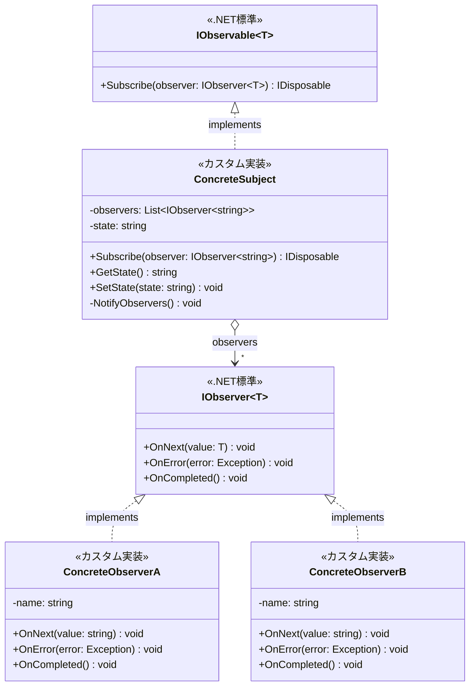
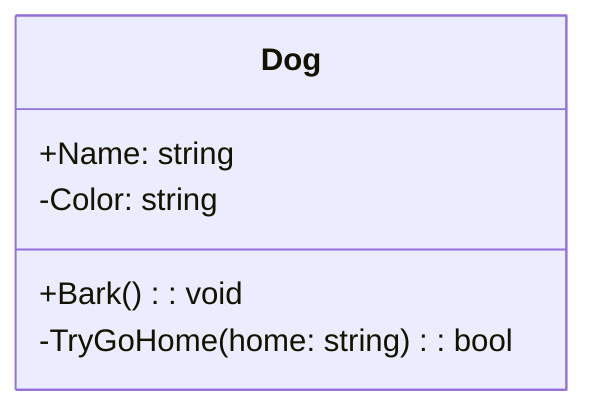
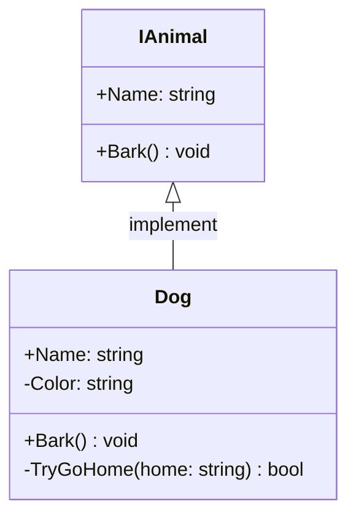
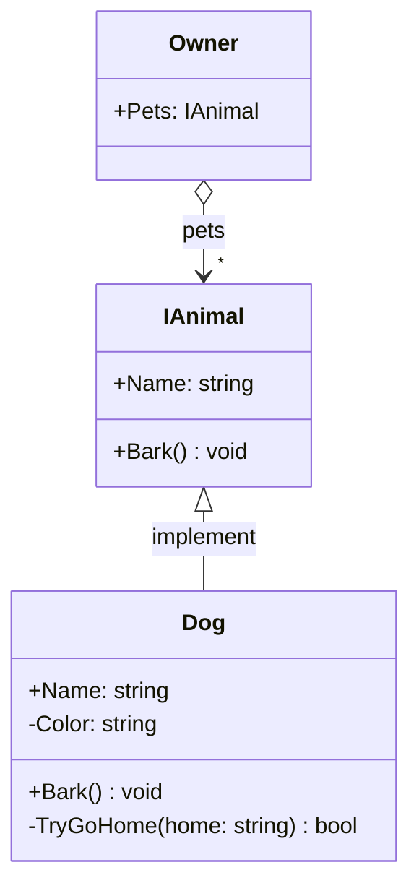
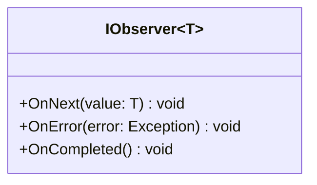
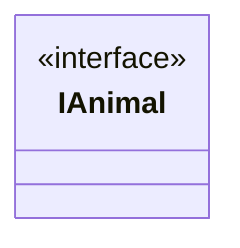

# クラス図をコードで書ける!？
[前回記事](https://qiita.com/sebayashi-tomoya/items/b23c3b0d09694a47cb37)を執筆していたときのこと。

Observerパターンのクラス図を書きたかったわけですが、クラス図を書くのって意外と手間ですよね？

そんなものもうAIに任せてしまえとClaudeにクラス図を書いてとお願いしたところ、ちゃちゃっと作ってくれました。

そこで、画像と共にあるコードが出力されていることに気がつきました。
```text
classDiagram
    class IObservable~T~ {
        <<.NET標準>>
        +Subscribe(observer: IObserver~T~) IDisposable
    }
    
    class ConcreteSubject {
        <<カスタム実装>>
        -observers: List~IObserver~string~~
        -state: string
        +Subscribe(observer: IObserver~string~) IDisposable
        +GetState() string
        +SetState(state: string) void
        -NotifyObservers() void
    }
    
    class IObserver~T~ {
        <<.NET標準>>
        +OnNext(value: T) void
        +OnError(error: Exception) void
        +OnCompleted() void
    }
    
    class ConcreteObserverA {
        <<カスタム実装>>
        -name: string
        +OnNext(value: string) void
        +OnError(error: Exception) void
        +OnCompleted() void
    }
    
    class ConcreteObserverB {
        <<カスタム実装>>
        -name: string
        +OnNext(value: string) void
        +OnError(error: Exception) void
        +OnCompleted() void
    }
    
    IObservable~T~ <|.. ConcreteSubject : implements
    IObserver~T~ <|.. ConcreteObserverA : implements
    IObserver~T~ <|.. ConcreteObserverB : implements
    ConcreteSubject o--> "*" IObserver~string~ : observers
```

<details><summary>実際に描画されるクラス図</summary>



</details>

draw.ioでせっせと手書きすることばかりしていた私は衝撃を受けました。
こんなスマートにクラス図を書けるなら習得するしかないですよね？

ということで今回はクラス図をコードのような書き方で表現する手法をまとめていきます。

# どうしてコードがクラス図として表示されるのか
Mermaidというツールのおかげです。
PlantUMLは聞いたことあるますが、それとはまた別のツールみたいですね。

(Qiita記事はMermaidもPlantUMLも対応しているそうですね)

https://mermaid.js.org/intro/

> Mermaid を使用すると、テキストとコードを使用して図や視覚化を作成できます。
これは、Markdown 風のテキスト定義をレンダリングして、図を動的に作成および変更する JavaScript ベースの図表作成およびチャート作成ツールです。

とのこと。Markdown風のテキストを図に変換してくれる非常に便利なツールです。
先ほどのコードをMarkdown文書にMermaidのコードブロックとして埋め込むと図で描画されます。

# 基本的な記法
クラス図以外にも、フローチャートやシーケンス図、グラフも対応していますが、今回はクラス図にフォーカスして他は触れません。

## クラス
```text
classDiagram
    class クラス名 {
        +公開属性: 型
        -非公開属性: 型
        #保護属性: 型
        +公開メソッド(引数: 型): 戻り値型
        -非公開メソッド(引数: 型): 戻り値型
    }
```
- \+ : public
- \- : private
- \# : protected

<details><summary>実装例</summary>

```text
classDiagram
    class Dog {
        +Name: string
        -Color: string
        +Bark(): void
        -TryGoHome(home: string): bool
    }
```

**結果**

</details>

## 継承や実装
```text
親クラス <|-- 子クラス : ラベル
```

<details><summary>実装例</summary>

```text
classDiagram
    class IAnimal {
        +Name: string
        +Bark() void
    }

    class Dog {
        +Name: string
        -Color: string
        +Bark() void
        -TryGoHome(home: string) bool
    }

    IAnimal <|-- Dog : implement
```

**結果**



</details>

## コンポジション・集約

```text
クラスA o-- クラスB : ラベル      // 集約（open diamond）
クラスA *-- クラスB : ラベル      // コンポジション（filled diamond）
クラスA --> クラスB : 使用関係
```

<details><summary>実装例</summary>

```text
classDiagram
    class Owner{
        +Pets: IAnimal
    }

    class IAnimal {
        +Name: string
        +Bark() void
    }

    class Dog {
        +Name: string
        -Color: string
        +Bark() void
        -TryGoHome(home: string) bool
    }

    IAnimal <|-- Dog : implement
    Owner o--> "*" IAnimal : pets
```

**結果**



</details>

## ジェネリクス（型引数）
~T~ や ~string~をつけて表現。

<details><summary>実装例</summary>

```text
classDiagram
    class IObserver~T~ {
        +OnNext(value: T) void
        +OnError(error: Exception) void
        +OnCompleted() void
    }
```

**結果**



</details>

## ステレオタイプの表現

```text
classDiagram
    class クラス名 {
        <<ステレオタイプ>>
    }
```

<details><summary>実装例</summary>

```text
classDiagram
    class IAnimal {
        <<interface>>
    }
```

**結果**



</details>
